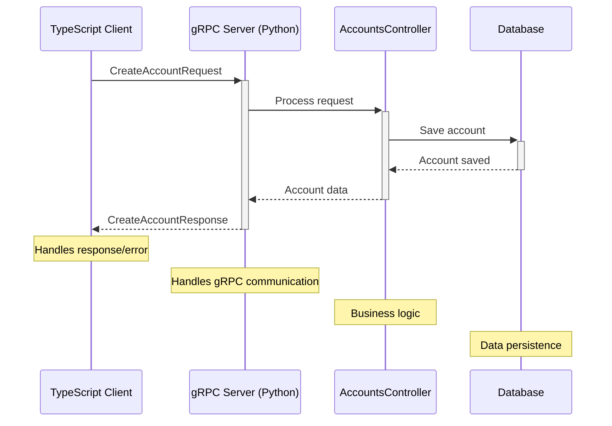

# CRM Platform - Backend Service

A high-performance gRPC-based backend service for a modern Customer Relationship Management (CRM) platform, built with Python and UV.

## 🚀 Features

- **gRPC API** - High-performance RPC framework with TypeScript/Node.js client support
- **UV** - Fast Python package manager and runtime
- **Modular Architecture** - Clean separation of concerns
- **Type Safety** - Protocol Buffers for type-safe API contracts
- **Cross-Platform** - Seamless TypeScript/Node.js client integration

## 🏗️ Project Structure

```
├── gen/                    # Generated gRPC code
├── protos/                 # Protocol Buffer definitions
│   └── accounts.proto      # Accounts service definition
├── src/
│   ├── Services/           # Service implementations
│   │   └── AccountsService.py
│   ├── controllers/        # Business logic
│   │   └── AccountsController.py
│   └── main.py            # Application entry point
├── pyproject.toml         # Project dependencies and configuration
└── README.md              # This file
```

## 🛠️ Setup

1. **Prerequisites**
   - Python 3.8+
   - UV (Python package manager)
   - Protocol Buffers compiler (protoc)

2. **Install Dependencies**
   ```bash
   uv pip install -r requirements.txt
   ```

3. **Generate gRPC Code**
   ```bash
   python -m grpc_tools.protoc -I .\protos --python_out=.\gen --grpc_python_out=.\gen .\protos\accounts.proto
   ```

4. **Run the Server**
   ```bash
   cd src
   python main.py
   ```

## 🚦 Client-Server Interaction

### TypeScript Client Setup

1. **Install Dependencies**
   ```bash
   npm install @grpc/grpc-js @grpc/proto-loader typescript ts-node
   ```

2. **Generate TypeScript Types**
   ```bash
   npx grpc_tools_node_protoc \
     --js_out=import_style=commonjs,binary:./client/src/generated \
     --grpc_out=grpc_js:./client/src/generated \
     --plugin=protoc-gen-grpc=./node_modules/.bin/grpc_tools_node_protoc_plugin \
     -I=./protos \
     ./protos/*.proto
   ```

### Create Account Flow



### Example Implementation

<details>
<summary>🔽 TypeScript Client Example</summary>

```typescript
import * as grpc from '@grpc/grpc-js';
import * as protoLoader from '@grpc/proto-loader';
import { ProtoGrpcType } from './generated/accounts';

const PROTO_PATH = __dirname + '/../../protos/accounts.proto';
const packageDefinition = protoLoader.loadSync(PROTO_PATH);
const proto = grpc.loadPackageDefinition(packageDefinition) as unknown as ProtoGrpcType;

const client = new proto.accounts.v1.AccountsService(
  'localhost:50051',
  grpc.credentials.createInsecure()
);

// Create Account Example
const createAccount = () => {
  const request = {
    name: 'John Doe',
    email: 'john@example.com',
    password: 'securepassword123'
  };

  client.createAccount(request, (error, response) => {
    if (error) {
      console.error('Error:', error);
      return;
    }
    console.log('Account created:', response);
  });
};
```
</details>

<details>
<summary>🔽 Python Server Example</summary>

```python
# In Services/AccountsService.py
class AccountsService(AccountsServiceServicer):
    def __init__(self):
        self.accounts_controller = AccountsController()
    
    def CreateAccount(self, request, context):
        try:
            # Delegate to controller for business logic
            account = self.accounts_controller.create_account(request)
            return accounts_pb2.CreateAccountResponse(
                id=account.id,
                name=account.name,
                email=account.email
            )
        except Exception as e:
            context.set_code(grpc.StatusCode.INTERNAL)
            context.set_details(str(e))
            return accounts_pb2.CreateAccountResponse()
```
</details>

### Protocol Buffer Definition

```protobuf
syntax = "proto3";

package accounts.v1;

service AccountsService {
    rpc CreateAccount (CreateAccountRequest) returns (CreateAccountResponse);
}

message CreateAccountRequest {
    string name = 1;
    string email = 2;
    string password = 3;
}

message CreateAccountResponse {
    string id = 1;
    string name = 2;
    string email = 3;
}
```

## 📚 API Reference

### Accounts Service

- **CreateAccount**
  - **Request**: `CreateAccountRequest`
    - `name` (string): Full name of the user
    - `email` (string): User's email address
    - `password` (string): Account password (should be hashed in production)
  - **Response**: `CreateAccountResponse`
    - `id` (string): Unique account identifier
    - `name` (string): User's full name
    - `email` (string): User's email address

## 🚧 Development

### Adding New RPCs
1. Define the RPC in `protos/accounts.proto`
2. Generate the gRPC code
3. Implement the service method in `Services/AccountsService.py`
4. Add corresponding controller logic in `controllers/AccountsController.py`

### Testing
```bash
# Run tests
pytest tests/
```

